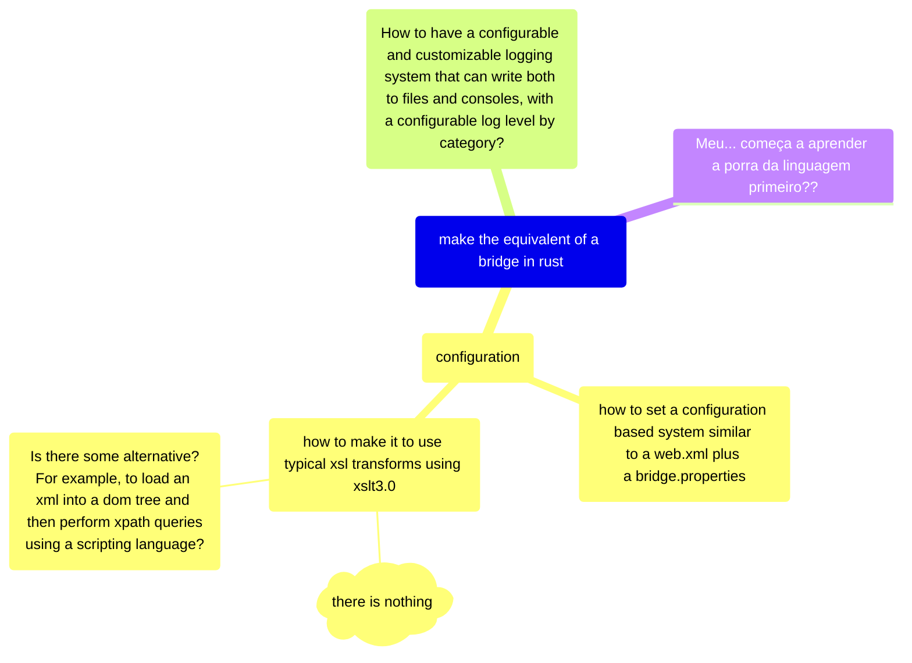

# The big challenges:

The Rust package system is far from being powerful.

While most languages 

```mermaid
mindmap main("make the equivalent of a bridge in rust")
  config(configuration)
    bla("
how to set a configuration based system similar 
to a web.xml plus 
a bridge.properties")
    ble("how to make it to use typical xsl transforms using xslt3.0")
        )there is nothing(
        alt(Is there some alternative?
        For example, to load an xml into a dom tree and then perform xpath queries
        using a scripting language?
        )
  logging("How to have a configurable and customizable logging system that can write both 
  to files and consoles, with a configurable log level by category?")
  Meu... começa a aprender a porra da linguagem primeiro??
```
